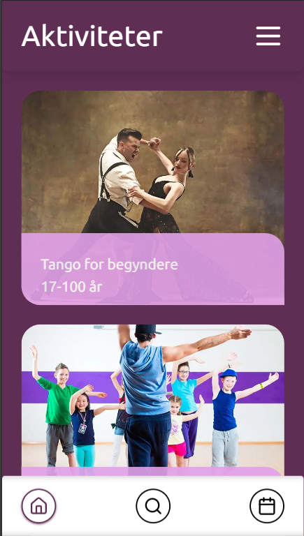

Kristian Bønløkke  
CMK-WU11  
Eksamensopgave - Webudvikler (EUD)


# Landrup Dans - en web app til en danseskole  



Se applikationen her: [https://kb-landrup-dans-blue.vercel.app](https://kb-landrup-dans-blue.vercel.app)

**Vigtigt** - Automatiseret deployment til <https://kb-landrup-dans-blue.vercel.app> med Vercel, giver det problem at 'hobby projekter' hos Vercel, har en timeout på 5 sekunder, for server-requests. - Da api'et som er hosted med render.com, <https://kb-landrup-dans-api.onrender.com>, tager længere tid, for requests til login, og registrering af bruger, virker dette ikke i deployment.   
**Jeg vil derfor gerne eksamineres, med projektet serveret over localhost**

## Brugere og adgangskoder
| Brugernavn | Adgangskode |
| - | - |
| user1 | 1234 |
| user2 | 1234 |
| user3 | 1234 |
| user4 | 1234 |
| user5 | 1234 |
| user6 | 1234 |
| instructor1 | 1234 |
| instructor2 | 1234 |
| instructor3 | 1234 |
| instructor4 | 1234 |


## Dokumentation  
### Teknologi-stack:  
- NextJS 15 (app-framework)
- ReactJS 19 (frontend-bibliotek)
- TailwindCSS (CSS-framework)
- Zod (validerings-bibliotek)
- Lucide-react (react ikon-bibliotek) 

### Framework (NextJS)  
NextJS er et ReactJS-framework, designet til udvikling af komponentbaserede webapplikationer. Det er bygget på NodeJS som muliggør server-side rendering af JSX-komponenter, og backend integration.  

Mens React med dets virtuelle DOM, diverse hooks til state-håndtering, og et væld af tredjeparts-biblioteker, er et effektivt og populært værktøj til at bygge dynamiske og interaktive frontend-UI’s, tilbyder Next.js bl.a.: 
- mappe-baseret routing (app-router) 
- server-side rendering (SSR), 
- statisk side generering (SSG),  
- indbyggede caching mekanismer, 
- API-integration, 
- Internationalisering
- generel SEO og performance optimering. 


Se NextJS egen dokumentation her <https://www.nextjs.org/docs>


### Landrup-dans (SEO)
Opgaven benytter sig af en række af NextJS's features for nem implementering af SEO:   
Ved brug af metadata objektet inkluderes, foruden titel og beskrivelse:
- Canonical URL's
- OpenGraph og Twitter metadata
- Der dannes et OpenGraph billede vha. Next/Vercel's imageResponse, se - /app/api/og/[aspect]/route.js 
- Med generateMetadata funktionen dannes der titel og beskrivelse for dynamiske routes. 
- Der oprettes en sitemap.xml vha af sitemap.js funktion
- og en robots.txt med robots.js

### Landrup-dans (Performance)    
Ligeledes benytter app'en Next's muligheder for performance optimering
#### Caching, SSR, SSG, Incremental Static Regeneration (ISR)
En afgørende ændring i den nyeste version af NextJS (version 15, oktober 2024, <https://nextjs.org/blog/next-15>) er standard-indstillingen for caching af GET requests og pages komponenter. Hvor tidligere versioner automatisk cachede disse, skal det nu aktivt vælges til, som i eksemplet her.   

```javascript
const response = await fetch(
    `${baseUrl}/api/v1/activities`,
    { cache: 'force-cache' },
    { next: { revalidate: 3600 } }
  )

```
Her bestemmes det med 'force-cache' at Next skal cache resultatet af vores fetch, og med { revalidate: 3600 } (default: 'false') at den cachede version skal invalideres for en ny opdateret cache hver time.  

En anden performance faktor, er hvordan server-side komponenter skal renderes. Her er mulighederne: 
- Static - prærenderet som statisk indhold
- SSG - prærenderet som statisk HTML
- Dynamic - server-renderet on-demand  

Statisk rendering kan tilvælges ved at tilføje ```export const dynamic = 'force-static'```, i server-side komponenter, og ligesom med fetch caching, kan ```export const revalidate = (antal sekunder)``` sætte interval for revalidering af det statiske indhold.   

For Landrup-dans app'en har jeg tilvalgt SSG/Static for de fleste sider, da dens indhold umiddelbart ikke skal opdateres konstant, og hurtig time-to-first-byte (TTTB), derfor er at foretrække.   

Omvendt for den side der skal vise en brugers kalender, har jeg valgt dynamisk SSR on-demand, så vi altid får det seneste resultat direkte fra datakilden.  

Et andet typisk scenarie for opt-in af dynamisk SSR, er en server-action søgeformular, hvor siden for resultatvisning er afhængig af søgeordet fra searchParams ved hver request. 

##### SSG - generateStaticParams()  

Et sidste performance aspekt, som landrup-dans app’en benytter, er Next’s indbyggede funktion til at generateStaticParams(), som anvendes til de dynamiske routes for hver enkelt fitness-hold.   

Med denne funktion bygges de dynamiske routes på forhånd ved build-time.
Dette er yderliger optimeret ved at anvende den indbyggede prefetch attribut af Next’s Link komponent.  

I min page.jsx af /activites/[id], har jeg således nu tre fetches til det samme api endpoint. 
Et for generateStaticParams(), et for generateMetadata(), og et for komponent funktionen. 
Her kan nævnes endnu en smart indbygget caching mekanisme i NextJS, hvor det - når vi vel at mærke bruger fetch API’et -  deduplikerer data’en af de identiske fetches og deler data’en mellem de tre funktioner.  
<https://nextjs.org/docs/app/building-your-application/data-fetching/fetching#reusing-data-across-multiple-functions> 


### Kode-eksempel

Jeg har valgt at inddrage dette noget lange eksempel nedenfor, da det illustrerer en kombination af client-side komponenter for state-håndtering af UI, og server-side actions. Knappen for til- og afmelding af danse-hold, er lavet med følgende flow:
- Komponenten tjekker om en bruger er logget ind, og hvis ikke returnerer den null (knappen vises ikke).
- Komponenten tager imod nogle 'tjeks' for hold-tilmeldings restriktioner i (props).  
- state isEnrolled (useState) tager tjek for brugers hold-tilmeldinger(issignedUp) som initial value
- statet viser en knap for til- eller afmelding afhængigt af initial value
- onClick af knappen kalder server-actions handleJoin eller handleLeave
- Hvis der er alders eller ugedag konflikt for tilmelding, vises meddelelse i toast for brugeren (se contexts/ToastContext.jsx)
- Hvis ingen konflikt og respons er ok vises en succes meddelelse, og isEnrolled state opdaterer knappen.  


// app/activities/[id]/page.jsx + components/EnrollButton.jsx  

```javascript

//app/activities/[id]/page.jsx

 //Tjek om bruger er tilmeldt hold, og opfylder krav for tilmelding (alder og ugedag)
const isSignedUp = activity.users.some(user => user.id == uid)

const hasWeekdayConflict = user?.activities?.some(item => item.weekday === activity.weekday)

const hasAgeConflict = user?.age < activity.minAge || user?.age > activity.maxAge

//components/EnrollButton.jsx
'use client'
import { useToast } from "@/contexts/ToastContext"
import { useState } from "react"

export default function EnrollButton({ isSignedUp, uid, token, activity, hasAgeConflict, hasWeekdayConflict, className }) {
    const [isEnrolled, setIsEnrolled] = useState(isSignedUp)
    const { toast } = useToast()
    const baseUrl = process.env.NEXT_PUBLIC_BASE_URL

    if (!token) {
        return null
    }

    async function handleJoin() {

        if (hasAgeConflict) {
            toast(
                <div>
                    <p className="text-red-500 text-4xl py-6 text-center">Tilmelding fejlede</p>
                    <p>
                        Du skal være mellem {activity.minAge} og {activity.maxAge} år for at deltage i {activity.name}
                    </p>
                </div>,
                {duration: 5000}

            )
            return
        }

        if (hasWeekdayConflict) {
            toast(
                <div>
                    <p className="text-red-500 text-4xl py-6 text-center">Tilmelding fejlede</p>
                    <p>
                        Grundet stor efterspørgelse på vores hold, kan du kun være tilmelt ét hold om dagen
                    </p>
                </div>,
                {duration: 5000}

            )
            return
        }

        const response = await fetch(`${baseUrl}/api/v1/users/${uid}/activities/${activity.id}`, {
            method: "POST",
            headers: {
                "Content-type": "application/json",
                "Authorization": `Bearer ${token?.value}`
            }
        })

        if (!response.ok) {
            console.log(response)
            return
        }

        const result = await response.json()
       

        if (response.ok) {
            setIsEnrolled(true)
            toast(
                <div>
                    <p className="text-green-500 text-4xl py-6 text-center">Succes!</p>
                    <p>
                        Du er nu tilmeldt {result.name}
                    </p>
                </div>,
                {duration: 2500}
            )
        }
    }

    async function handleLeave() {
        const response = await fetch(`${baseUrl}/api/v1/users/${uid}/activities/${activity.id}`, {
            method: "DELETE",
            headers: {
                "Authorization": `Bearer ${token?.value}`
            }
        })

        if (!response.ok) {
            console.log(response)
            return
        }

        if (response.ok) {
            setIsEnrolled(false)
            toast(
                <div>
                    <p className="text-green-500 text-4xl py-6 text-center">Succes!</p>
                    <p>
                        Du er nu afmeldt {activity.name}
                    </p>
                </div>,
                {duration: 2500}
            )
        }
    }


    return (
        <>
            {isEnrolled
                ? <button className={className} onClick={handleLeave}>Afmeld</button>
                : <button className={className} onClick={handleJoin}>Tilmeld</button>}
        </>
    )
}

```


